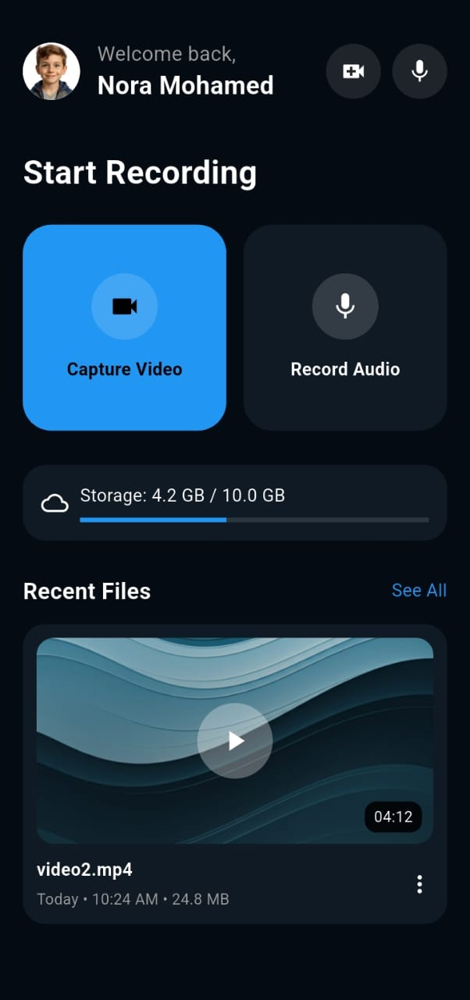
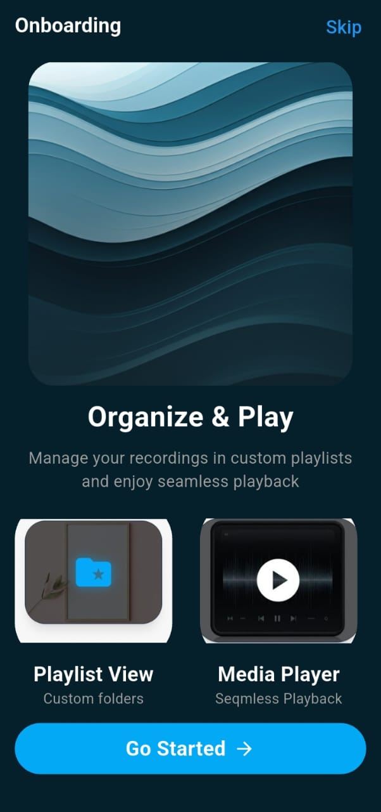

# Video Player App 🎥

A Flutter application that allows users to play and record videos.

## 🚀 Features
- Play video from device
- Record video using camera
- Simple UI

## 📸 Screenshots

## 🛠️ Technologies Used
- Flutter
- Dart

## ▶️ How to Run
1. Clone the project
2. Run `flutter pub get`
3. Run the app
